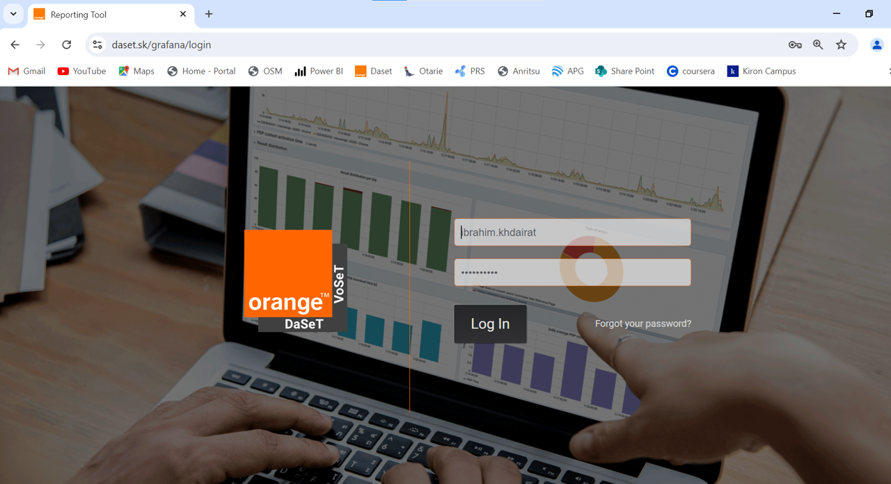

# Service Assurance Document

In this document we will have detailed steps to use our monitoring tools and extract the data from it.

In OJO we have multiple services divided into many categories:

## 1. Digital Services

In this section we will see how to extract the data for any digital services from our monitoring tool [Daset/Grafana](https://www.daset.sk/grafana/login).

1. Go to [Daset/Grafana](https://www.daset.sk/grafana/login) and enter your username and password.

